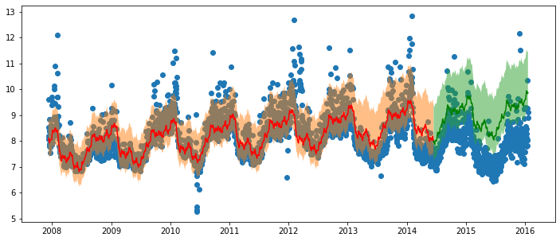
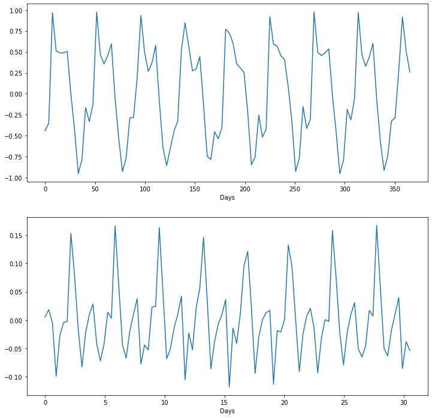

<!--

#################################################
### THIS FILE WAS AUTOGENERATED! DO NOT EDIT! ###
#################################################
# file to edit: 99_index.ipynb
# command to build the docs after a change: nbdev_build_docs

-->

# ProFeTorch

> FB Prophet + Fastai + pyTorch.


This is an alternative implementation of prophet which uses quantile regression instead of MCMC sampling. It provides the following benefits over prophet:
- GPU usage.
- Strict(er) upper and lower bounds.
- Can add any other set of features to the time series.

The time series is implemented as follows:
$$
\begin{aligned}
y &= b(T(t) + S(t) + F(x)|l,u) \\
T(t) &= mt + a \\
S(t) &= \sum_{n=1}^N\left(a_n \cos\left(\frac{2\pi nt}{P}\right) + b_n \sin\left(\frac{2\pi nt}{P}\right)\right) \\
F(x) &= w^T x\\
b(y|l,u) &= \begin{cases}
l \quad \text{if } y < l \\
y \quad \text{if } l < y < u \\
u \quad \text{if } y > u
\end{cases}
\end{aligned}
$$

where $T(t)$ is the trend line, $S(t)$ are the seasonal components composed of a fourier sum, $F(x)$ is a linear function which weights features that is not related to time.

The task is therefore to find the parameters $a, m, \cup_n a_n, \cup_n b_n, w$ that minimises a loss function $l(\hat{y}, y)$. The default is set to minimise $l1$ loss $\frac{1}{N}\sum_{i=1}^N |y_i - \hat{y_i}|$ so that the reliance on outliers is minimised. By default we also calculate the 5th and 95th quantile by minimising the tilted loss function. The quantile functions are calculated as:
$$
\begin{aligned}
y_5 &= b(\hat{y} - (m_5 t + a_5)|l,u) \\
y_{95} &= b(\hat{y} + (m_{95} t + a_{95})|l,u)
\end{aligned}
$$

## Install

`pip install profetorch`

## ProFeTorch Training
<div class="codecell" markdown="1">
<div class="input_area" markdown="1">

```python
model_params = {'y_n':10, 'm_n':7, 'l':0, 'h': train_df['y'].max() * 2}
model = Model(model_args=model_params, epochs=30, alpha=1e-2)
model.fit(train_df)
```

</div>
<div class="output_area" markdown="1">

    /opt/miniconda3/lib/python3.7/site-packages/pandas/core/frame.py:4117: SettingWithCopyWarning: 
    A value is trying to be set on a copy of a slice from a DataFrame
    
    See the caveats in the documentation: http://pandas.pydata.org/pandas-docs/stable/user_guide/indexing.html#returning-a-view-versus-a-copy
      errors=errors,


    Epoch 30/30 Training Loss: 0.3680, Validation Loss: 0.5957

</div>

</div>
<div class="codecell" markdown="1">
<div class="input_area" markdown="1">

```python
y_pred = model.predict(df)
plt.figure(figsize=(12,5))
plt.scatter(df['ds'], df['y'], label='Data')
plt.plot(train_df['ds'], y_pred[:train_len,1], c='r', label='Train Set')
plt.fill_between(train_df['ds'], y_pred[:train_len,0], y_pred[:train_len,2], alpha=0.5)
plt.plot(test_df['ds'], y_pred[train_len:,1], c='g', label='Test Set')
plt.fill_between(test_df['ds'], y_pred[train_len:,0], y_pred[train_len:,2], alpha=0.5)
plt.show()
```

</div>
<div class="output_area" markdown="1">





</div>

</div>
<div class="codecell" markdown="1">
<div class="input_area" markdown="1">

```python
model.plot_components()
```

</div>
<div class="output_area" markdown="1">





</div>

</div>
<div class="codecell" markdown="1">
<div class="input_area" markdown="1">

```python
list(model.named_parameters())
```

</div>
<div class="output_area" markdown="1">


    [('model.models.0.trend.init_layer.weight', Parameter containing:
      tensor([[0.0235]], requires_grad=True)),
     ('model.models.0.trend.init_layer.bias', Parameter containing:
      tensor([0.0338], requires_grad=True)),
     ('model.models.1.trend.init_layer.weight', Parameter containing:
      tensor([[0.3881]], requires_grad=True)),
     ('model.models.1.trend.init_layer.bias', Parameter containing:
      tensor([0.0006], requires_grad=True)),
     ('model.models.1.seasonal.yearly.linear.weight', Parameter containing:
      tensor([[-0.2984,  0.0334, -0.1572, -0.0445,  0.0025,  0.0630,  0.0033, -0.0534,
                0.0085,  0.0018, -0.6378, -0.1152,  0.1973,  0.1215,  0.0867, -0.0102,
               -0.0279, -0.0918, -0.0109, -0.0809]], requires_grad=True)),
     ('model.models.1.seasonal.monthly.linear.weight', Parameter containing:
      tensor([[-0.0315,  0.0295,  0.0279, -0.0243, -0.0060, -0.0025,  0.0127,  0.0304,
               -0.0582,  0.0004,  0.0020,  0.0055,  0.0186, -0.0176]],
             requires_grad=True)),
     ('model.models.2.trend.init_layer.weight', Parameter containing:
      tensor([[0.2818]], requires_grad=True)),
     ('model.models.2.trend.init_layer.bias', Parameter containing:
      tensor([0.9838], requires_grad=True))]


</div>

</div>

Obviously more works needs to be done as seen in the graph above. However, note that:
1. The seasonal component is captured.
2. The quantiles are asymmetric, which cannot happen in the fb-prophet case.
3. **I will fix these short comings if there is enough interest.**
